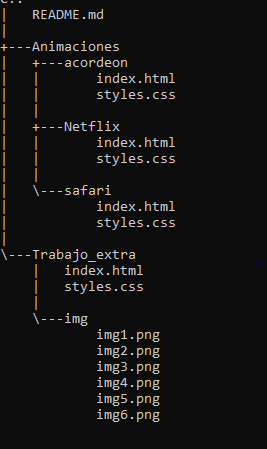

# TRABAJOS_REFUERZOS_ORTIZZULLY
Consta de dos carpetas una de animaciones y otra de Trabajo_extra el objetivo de los dos es mejorar mis habilidades en las animaciones y en la recreacion de paginas.

## Descripcion 

 **Animaciones**:
Esta carpeta contiene tres subcarpetas donde contiene animaciones diferentes

1. `Acordeon/`: Trabajado con CSS y HTML5 su funcion es hacer botones despegables con texto.
2. `Netflix/`: Trabajado con CSS y HTML5 su funcion recrear el logo de inicio de la plataforma netflix con sus movimientos y animaciones.
3. `Safari/`: Trabajado con CSS y HTML5 su funcion recrear el safari con sus movimientos.

**Trabajo_extra**:
Esta carpeta contiene el blog de una cafeteria, solo contiene estruturacion y mejora en estilos no cuenta con hipervinculos.

## Tecnologías usudas

En las dos carpetas hice uso de las siguientes tecnologías:

 * HTML5
 * CSS3

## Estructura del repositorio 

## Instrucciones de uso 

* Clona este repositorio o descarga los archivos en tu máquina local.
* Abre el archivo index.html en un navegador web compatible.

## Créditos
Este repositorio fue elaborado por Zully Fernanda Ortiz Avendaño Cc.1092528097 con el fin de mejorar y reforzar mis habilidades e conocimientos en animaciones y recraciones de proyectos en HTML y CSS